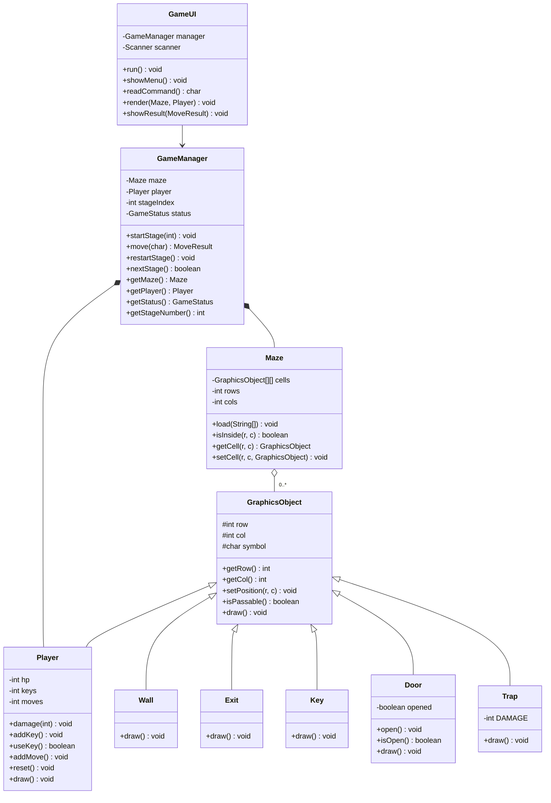
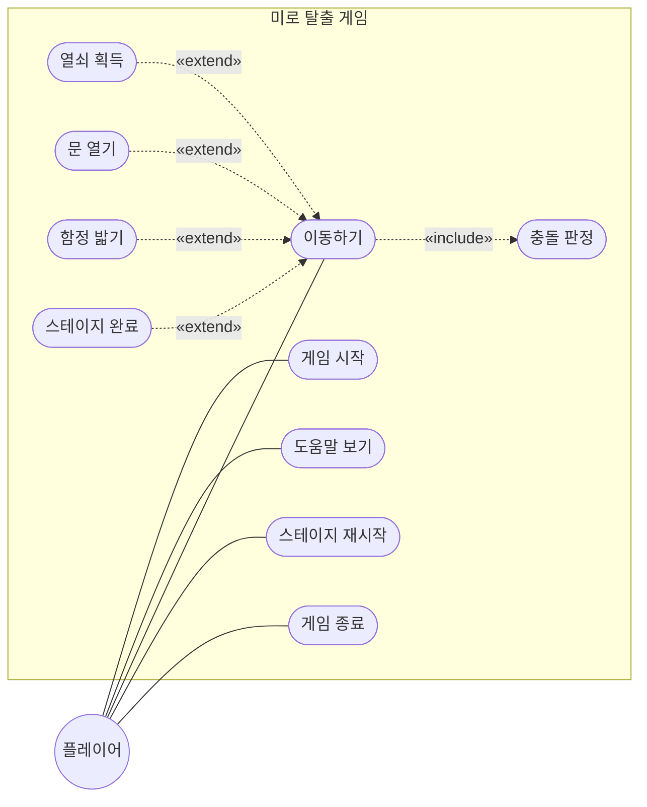

## 8. Class Diagram

```mermaid
classDiagram
    class GameUI {
        -GameManager manager
        -Scanner scanner
        +run() void
        +showMenu() void
        +readCommand() char
        +render(Maze, Player) void
        +showResult(MoveResult) void
    }
    class GameManager {
        -Maze maze
        -Player player
        -int stageIndex
        -GameStatus status
        +startStage(int) void
        +move(char) MoveResult
        +restartStage() void
        +nextStage() boolean
        +getMaze() Maze
        +getPlayer() Player
        +getStatus() GameStatus
        +getStageNumber() int
    }
    class Maze {
        -GraphicsObject[][] cells
        -int rows
        -int cols
        +load(String[]) void
        +isInside(r, c) boolean
        +getCell(r, c) GraphicsObject
        +setCell(r, c, GraphicsObject) void
    }
    class GraphicsObject {
        #int row
        #int col
        #char symbol
        +getRow() int
        +getCol() int
        +setPosition(r, c) void
        +isPassable() boolean
        +draw() void
    }
    class Player {
        -int hp
        -int keys
        -int moves
        +damage(int) void
        +addKey() void
        +useKey() boolean
        +addMove() void
        +reset() void
        +draw() void
    }
    class Wall {
        +draw() void
    }
    class Exit {
        +draw() void
    }
    class Key {
        +draw() void
    }
    class Door {
        -boolean opened
        +open() void
        +isOpen() boolean
        +draw() void
    }
    class Trap {
        -int DAMAGE
        +draw() void
    }

    GameUI --> GameManager
    GameManager *-- Maze
    GameManager *-- Player
    Maze o-- "0..*" GraphicsObject
    GraphicsObject <|-- Player
    GraphicsObject <|-- Wall
    GraphicsObject <|-- Exit
    GraphicsObject <|-- Key
    GraphicsObject <|-- Door
    GraphicsObject <|-- Trap
```

## 7.Use Case Diagram

```mermaid
flowchart LR
    P(("플레이어"))

    subgraph SYS["미로 탈출 게임"]
        UC1(["게임 시작"])
        UC2(["도움말 보기"])
        UC3(["이동하기"])
        UC8(["스테이지 재시작"])
        UC9(["게임 종료"])
        C(["충돌 판정"])
        UC4(["열쇠 획득"])
        UC5(["문 열기"])
        UC6(["함정 밟기"])
        UC7(["스테이지 완료"])
    end

    P --- UC1
    P --- UC2
    P --- UC3
    P --- UC8
    P --- UC9

    UC3 -. "«include»" .-> C
    UC4 -. "«extend»" .-> UC3
    UC5 -. "«extend»" .-> UC3
    UC6 -. "«extend»" .-> UC3
    UC7 -. "«extend»" .-> UC3
```
